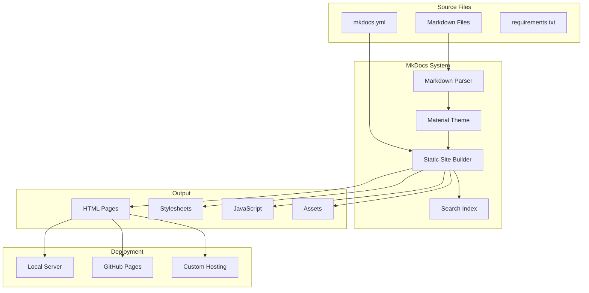
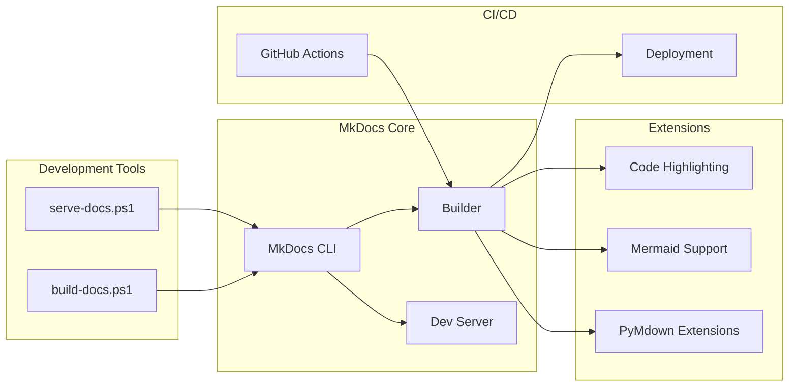
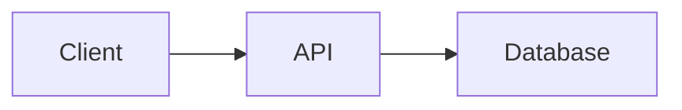

# MkDocs Documentation System - Design Document

## Overview

The MkDocs Documentation System provides a comprehensive, professional documentation solution for the License Management API. Built on MkDocs with the Material theme, it organizes existing documentation into a searchable, responsive website that can be served locally or deployed to GitHub Pages.

### Key Design Principles

- **Content-First**: Preserve and organize all existing documentation without loss
- **Developer-Friendly**: Simple Markdown editing with live reload for rapid iteration
- **Professional Appearance**: Modern Material Design with dark mode support
- **Easy Deployment**: Automated CI/CD pipeline for zero-friction publishing
- **Cross-Platform**: Works on Windows, macOS, and Linux
- **Minimal Dependencies**: Only Python and pip required

## Architecture

### High-Level Architecture



### Component Architecture



## Components and Interfaces

### Configuration Files

#### mkdocs.yml

Central configuration file defining:

```yaml
site_name: License Management API
site_description: Documentation for the License Management API
theme:
  name: material
  palette:
    - scheme: default
      primary: indigo
      accent: indigo
      toggle:
        icon: material/brightness-7
        name: Switch to dark mode
    - scheme: slate
      primary: indigo
      accent: indigo
      toggle:
        icon: material/brightness-4
        name: Switch to light mode
  features:
    - navigation.tabs
    - navigation.sections
    - navigation.expand
    - navigation.top
    - search.suggest
    - search.highlight
    - content.code.copy

markdown_extensions:
  - pymdownx.highlight
  - pymdownx.superfences:
      custom_fences:
        - name: mermaid
          class: mermaid
  - pymdownx.tabbed:
      alternate_style: true
  - admonition
  - pymdownx.details
  - tables
  - toc:
      permalink: true

nav:
  - Home: index.md
  - Getting Started:
      - Quick Start: getting-started/quick-start.md
      - Configuration: getting-started/configuration.md
      - Deployment: getting-started/deployment.md
  - API Reference:
      - Overview: api/overview.md
      - Authentication: api/authentication.md
      - Endpoints: api/endpoints.md
      - Postman Collection: api/postman.md
  - Architecture:
      - Database Schema: architecture/database.md
      - Design: architecture/design.md
  - Development:
      - Requirements: development/requirements.md
      - Testing: development/testing.md
      - Contributing: development/contributing.md
```

#### requirements.txt

Python dependencies:

```
mkdocs>=1.5.0
mkdocs-material>=9.4.0
pymdown-extensions>=10.3
```

### Directory Structure

```
project-root/
├── .github/
│   └── workflows/
│       └── docs.yml                 # CI/CD pipeline
├── docs/
│   ├── index.md                     # Home page
│   ├── README.md                    # Documentation guide
│   ├── assets/                      # Images, logos, etc.
│   ├── getting-started/
│   │   ├── quick-start.md
│   │   ├── configuration.md
│   │   └── deployment.md
│   ├── api/
│   │   ├── overview.md
│   │   ├── authentication.md
│   │   ├── endpoints.md
│   │   └── postman.md
│   ├── architecture/
│   │   ├── database.md
│   │   └── design.md
│   └── development/
│       ├── requirements.md
│       ├── testing.md
│       └── contributing.md
├── mkdocs.yml                       # MkDocs configuration
├── requirements.txt                 # Python dependencies
├── serve-docs.ps1                   # Local server script
├── build-docs.ps1                   # Build script
├── DOCUMENTATION.md                 # Setup guide
├── DOCS_QUICK_START.md             # Quick reference
└── site/                            # Generated output (gitignored)
```

## Data Models

### Navigation Structure

```yaml
Navigation:
  - Section:
      name: string
      items:
        - Page:
            title: string
            path: string (relative to docs/)
```

### Theme Configuration

```yaml
Theme:
  name: string (material)
  palette:
    - scheme: string (default | slate)
      primary: string (color name)
      accent: string (color name)
      toggle:
        icon: string
        name: string
  features: array of strings
```

### Markdown Extensions

```yaml
Extension:
  name: string
  options: object (extension-specific)
```

## Markdown Features

### Code Blocks

Syntax highlighting for multiple languages:

````markdown
```csharp
public class Customer
{
    public Guid Id { get; set; }
    public string Name { get; set; }
}
```
````

### Admonitions

Styled callout boxes:

```markdown
!!! note "Note Title"
    This is a note admonition.

!!! warning "Security Warning"
    This is a warning admonition.

!!! tip "Pro Tip"
    This is a tip admonition.

!!! info "Information"
    This is an info admonition.
```

### Tabbed Content

Multiple tabs for alternatives:

```markdown
=== "Azure"
    Azure-specific instructions

=== "AWS"
    AWS-specific instructions

=== "GCP"
    GCP-specific instructions
```

### Mermaid Diagrams

Flowcharts, sequence diagrams, ERDs:

````markdown

````

### Tables

Formatted tables:

```markdown
| Column 1 | Column 2 | Column 3 |
|----------|----------|----------|
| Value 1  | Value 2  | Value 3  |
```

## PowerShell Scripts

### serve-docs.ps1

**Purpose**: Serve documentation locally with live reload

**Flow**:
1. Check for Python installation
2. Check for pip installation
3. Check for MkDocs installation
4. Install dependencies if needed
5. Start MkDocs development server
6. Display server URL and instructions

**Error Handling**:
- Exit with code 1 if Python not found
- Exit with code 1 if pip not found
- Exit with code 1 if dependency installation fails
- Display colored error messages

### build-docs.ps1

**Purpose**: Build static documentation site

**Flow**:
1. Check for Python installation
2. Check for MkDocs installation
3. Install dependencies if needed
4. Build static site
5. Display output location and instructions

**Error Handling**:
- Exit with code 1 if Python not found
- Exit with code 1 if dependency installation fails
- Exit with code 1 if build fails
- Display colored error messages

## CI/CD Pipeline

### GitHub Actions Workflow

**Trigger Events**:
- Push to main branch (paths: docs/**, mkdocs.yml, requirements.txt)
- Pull request to main branch (same paths)
- Manual workflow dispatch

**Jobs**:

#### Build Job
1. Checkout repository
2. Setup Python 3.11
3. Install dependencies from requirements.txt
4. Build documentation with --strict flag
5. Upload build artifact

#### Deploy Job (main branch only)
1. Checkout repository
2. Setup Python 3.11
3. Install dependencies
4. Configure Git credentials
5. Deploy to GitHub Pages using mkdocs gh-deploy

**Permissions**:
- contents: write (for GitHub Pages deployment)

## Error Handling

### Build Errors

**Broken Links**:
```
WARNING - Doc file 'path/to/file.md' contains a link to 'missing.md', 
          but the target 'missing.md' is not found among documentation files.
```

**Missing Navigation Files**:
```
ERROR - Config value 'nav': The path 'path/to/file.md' set in the 'nav' 
        configuration does not exist.
```

**Invalid Markdown**:
```
ERROR - Error reading page 'path/to/file.md': [Errno 2] No such file or directory
```

### Script Errors

**Python Not Found**:
```
✗ Python not found. Please install Python 3.8+ from https://www.python.org/
```

**Dependency Installation Failed**:
```
✗ Failed to install dependencies
```

**Build Failed**:
```
✗ Failed to build documentation
```

## Testing Strategy

### Manual Testing

1. **Local Server**:
   - Run serve-docs.ps1
   - Verify server starts on port 8000
   - Test live reload by editing a file
   - Verify all pages load correctly
   - Test search functionality
   - Test dark mode toggle
   - Test navigation on mobile viewport

2. **Static Build**:
   - Run build-docs.ps1
   - Verify site/ directory created
   - Open site/index.html in browser
   - Verify all links work
   - Test on multiple browsers

3. **CI/CD**:
   - Create PR with documentation changes
   - Verify build job succeeds
   - Merge to main
   - Verify deployment to GitHub Pages
   - Check published site

### Validation

1. **Link Checking**:
   - Build with --strict flag
   - Verify no broken links reported

2. **Configuration Validation**:
   - Run mkdocs build
   - Verify no configuration errors

3. **Cross-Browser Testing**:
   - Test in Chrome, Firefox, Safari, Edge
   - Verify consistent rendering

## Performance Considerations

### Build Performance

- **Incremental Builds**: MkDocs only rebuilds changed files during serve
- **Caching**: Browser caching for static assets
- **Minification**: Material theme includes minified CSS/JS

### Search Performance

- **Index Size**: Search index generated at build time
- **Client-Side**: Search runs in browser, no server required
- **Lazy Loading**: Search index loaded on first search

### Page Load Performance

- **Static Files**: No server-side processing required
- **CDN-Ready**: Can be served from CDN for global distribution
- **Responsive Images**: Material theme optimizes images

## Security Considerations

### Build Security

- **Dependency Pinning**: requirements.txt specifies minimum versions
- **No Secrets**: No sensitive data in documentation
- **GitHub Actions**: Uses official actions with pinned versions

### Deployment Security

- **HTTPS**: GitHub Pages serves over HTTPS by default
- **No User Input**: Static site has no forms or user input
- **Content Security**: All content from trusted sources

## Deployment Options

### GitHub Pages (Recommended)

**Advantages**:
- Free hosting
- Automatic HTTPS
- Custom domain support
- Integrated with GitHub
- Automatic deployment via Actions

**Setup**:
1. Enable GitHub Pages in repository settings
2. Push to main branch
3. GitHub Actions deploys automatically

### Custom Hosting

**Options**:
- Azure Static Web Apps
- AWS S3 + CloudFront
- Netlify
- Vercel
- Any static hosting service

**Process**:
1. Run build-docs.ps1
2. Upload site/ directory to hosting provider

### Docker

**Dockerfile**:
```dockerfile
FROM python:3.11-slim
WORKDIR /docs
COPY requirements.txt .
RUN pip install -r requirements.txt
COPY . .
EXPOSE 8000
CMD ["mkdocs", "serve", "--dev-addr=0.0.0.0:8000"]
```

## Maintenance and Updates

### Adding New Pages

1. Create .md file in appropriate docs/ subdirectory
2. Add entry to nav section in mkdocs.yml
3. Test locally with mkdocs serve
4. Commit and push

### Updating Existing Pages

1. Edit .md file in docs/ directory
2. Preview changes with mkdocs serve
3. Commit and push

### Theme Customization

1. Edit theme section in mkdocs.yml
2. Test locally
3. Commit and push

### Dependency Updates

1. Update version in requirements.txt
2. Test locally
3. Update CI/CD if needed
4. Commit and push

## Requirements Traceability

This design satisfies the following requirements:

- **Requirement 1**: Documentation organized in docs/ with clear structure
- **Requirement 2**: Material theme provides professional UI with search and navigation
- **Requirement 3**: Markdown extensions support diagrams, admonitions, and tabs
- **Requirement 4**: serve-docs.ps1 provides local development workflow
- **Requirement 5**: build-docs.ps1 generates static site
- **Requirement 6**: GitHub Actions automates deployment
- **Requirement 7**: mkdocs.yml centralizes configuration
- **Requirement 8**: DOCUMENTATION.md provides maintenance guidelines
- **Requirement 9**: --strict flag and error reporting handle validation
- **Requirement 10**: MkDocs works cross-platform, PowerShell scripts for Windows convenience
