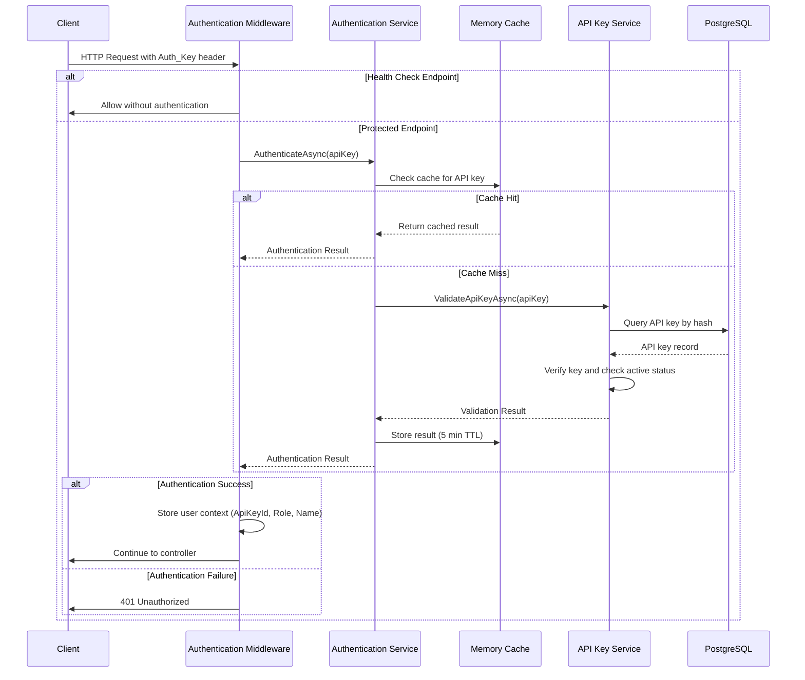
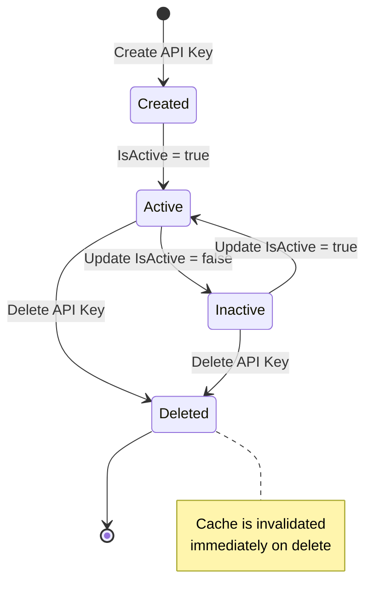

# Authentication and Authorization

This document describes the authentication and authorization mechanisms used in the License Management API.

## Overview

The License Management API uses a custom API key-based authentication system with role-based authorization. All endpoints (except health checks) require a valid API key to be passed in the request headers.

## Authentication Flow

### Request Authentication Process



### Step-by-Step Process

1. **Request Received**: Client sends HTTP request with `Auth_Key` header
2. **Middleware Intercept**: `AuthenticationMiddleware` intercepts the request
3. **Health Check Bypass**: If the request is to `/health`, authentication is skipped
4. **Header Validation**: Middleware checks for presence of `Auth_Key` header
5. **Cache Lookup**: Authentication service checks in-memory cache for the API key
6. **Cache Hit**: If found in cache and not expired (< 5 minutes), use cached result
7. **Cache Miss**: If not in cache, validate against database:
   - Hash the provided API key
   - Query database for matching hash
   - Verify the API key is active
   - Return validation result with role and metadata
8. **Cache Storage**: Store successful authentication result in cache for 5 minutes
9. **Context Storage**: Store authentication details in `HttpContext.Items`:
   - `ApiKeyId`: Unique identifier of the API key
   - `Role`: Role assigned to the API key
   - `Name`: Friendly name of the API key
10. **Authorization Check**: Controllers can access role information for authorization
11. **Response**: Return 401 if authentication fails, otherwise continue to controller

## API Key Management

### Creating API Keys

API keys are created through the `/api/apikeys` endpoint:

```http
POST /api/apikeys
Content-Type: application/json
Auth_Key: <existing-admin-key>

{
  "name": "Production API Key",
  "role": "Admin",
  "createdBy": "admin@example.com"
}
```

Response includes the plain-text API key (only shown once):

```json
{
  "id": "3fa85f64-5717-4562-b3fc-2c963f66afa6",
  "key": "LMA_1a2b3c4d5e6f7g8h9i0j1k2l3m4n5o6p7q8r9s0t",
  "name": "Production API Key",
  "role": "Admin",
  "isActive": true,
  "createdBy": "admin@example.com",
  "createdAt": "2024-01-15T10:30:00Z"
}
```

**Important**: The plain-text key is only returned during creation. Store it securely.

### API Key Storage

API keys are stored securely in the database:

1. **Generation**: Keys are generated using cryptographically secure random number generator
2. **Format**: Keys follow the pattern `LMA_<40-character-alphanumeric-string>`
3. **Hashing**: Keys are hashed using SHA256 before storage
4. **Database**: Only the hash is stored in the `ApiKeys` table
5. **Validation**: Incoming keys are hashed and compared against stored hashes

### API Key Lifecycle



### Cache Invalidation

When an API key is deleted:

1. The key is removed from the database
2. The authentication cache entry is immediately invalidated
3. Subsequent requests with that key will fail authentication
4. Maximum delay: 5 minutes (cache TTL) for other instances in distributed deployments

## Authorization

### Role-Based Access Control

The API implements role-based authorization with the following roles:

| Role | Description | Typical Permissions |
|------|-------------|---------------------|
| **Admin** | Full administrative access | All CRUD operations on all resources |
| **User** | Standard user access | Read operations, limited write operations |
| **ReadOnly** | Read-only access | GET operations only |

### Role Assignment

Roles are assigned when creating or updating API keys:

```http
PUT /api/apikeys/{id}
Content-Type: application/json
Auth_Key: <admin-key>

{
  "role": "User"
}
```

### Implementing Authorization in Controllers

Controllers can access the authenticated user's role from `HttpContext.Items`:

```csharp
public class CustomersController : BaseController
{
    [HttpDelete("{id}")]
    public async Task<IActionResult> DeleteCustomer(Guid id)
    {
        // Get role from context
        var role = HttpContext.Items["Role"]?.ToString();
        
        // Check authorization
        if (role != "Admin")
        {
            return Forbid(); // Returns 403 Forbidden
        }
        
        // Proceed with operation
        var result = await _customerService.DeleteCustomerAsync(id);
        return ToActionResult(result);
    }
}
```

### Authorization Responses

| Status Code | Scenario | Response |
|-------------|----------|----------|
| **200 OK** | Authenticated and authorized | Successful operation |
| **401 Unauthorized** | Missing or invalid Auth_Key | `{"message": "Missing or invalid Auth_Key header", "errorCode": "UNAUTHORIZED"}` |
| **403 Forbidden** | Valid Auth_Key but insufficient permissions | `{"message": "Insufficient permissions", "errorCode": "FORBIDDEN"}` |

## Security Considerations

### API Key Security

1. **Secure Generation**: Keys use cryptographically secure random number generator
2. **Minimum Length**: 40 characters plus prefix (total 44 characters)
3. **One-Way Hashing**: Keys are hashed with SHA256 before storage
4. **No Reversibility**: Original keys cannot be recovered from database
5. **Unique Hashes**: Database enforces unique constraint on key hashes

### Authentication Security

1. **HTTPS Only**: Always use HTTPS in production to prevent key interception
2. **Header-Based**: Keys are passed in headers, not URL parameters
3. **Cache Security**: Cached authentication results are stored in memory only
4. **Cache Expiration**: 5-minute TTL limits exposure window
5. **Immediate Invalidation**: Deleted keys are immediately removed from cache

### Best Practices

1. **Rotate Keys Regularly**: Create new keys and delete old ones periodically
2. **Principle of Least Privilege**: Assign minimum required role
3. **Audit Trail**: All API key operations include audit metadata (CreatedBy, CreatedAt, LastUsedAt)
4. **Monitor Usage**: Track LastUsedAt to identify unused keys
5. **Secure Storage**: Store API keys in secure vaults (Azure Key Vault, AWS Secrets Manager)
6. **Environment Variables**: Use environment variables for API keys in applications
7. **Never Commit Keys**: Never commit API keys to source control

## Bootstrapping Authentication

### Initial Setup Problem

The API requires authentication for all endpoints including the API key creation endpoint. This creates a chicken-and-egg problem for initial setup.

### Solution: Temporary Authentication Bypass

For initial setup only:

1. **Disable Authentication**: Comment out the authentication middleware in `Program.cs`:

```csharp
// app.UseMiddleware<AuthenticationMiddleware>(); // Temporarily disabled
```

2. **Start Application**: Run the application without authentication

3. **Create Admin Key**: Use the API to create an admin API key:

```bash
curl -X POST http://localhost:5000/api/apikeys \
  -H "Content-Type: application/json" \
  -d '{
    "name": "Bootstrap Admin Key",
    "role": "Admin",
    "createdBy": "system"
  }'
```

4. **Save the Key**: Store the returned API key securely

5. **Re-enable Authentication**: Uncomment the middleware line in `Program.cs`

6. **Restart Application**: Restart with authentication enabled

7. **Test Authentication**: Verify the key works:

```bash
curl -H "Auth_Key: LMA_your_key_here" http://localhost:5000/api/customers
```

### Alternative: Database Seeding

For automated deployments, seed an initial API key in the database:

```csharp
// In Program.cs or a database seeder
public static async Task SeedInitialApiKey(IServiceProvider services)
{
    using var scope = services.CreateScope();
    var context = scope.ServiceProvider.GetRequiredService<LicenseManagementDbContext>();
    
    if (!await context.ApiKeys.AnyAsync())
    {
        var apiKey = new ApiKey
        {
            Id = Guid.NewGuid(),
            KeyHash = HashApiKey("LMA_initial_admin_key_change_immediately"),
            Name = "Initial Admin Key",
            Role = "Admin",
            IsActive = true,
            CreatedBy = "system",
            CreatedAt = DateTime.UtcNow,
            UpdatedAt = DateTime.UtcNow
        };
        
        context.ApiKeys.Add(apiKey);
        await context.SaveChangesAsync();
    }
}
```

**Important**: Change or delete the seeded key immediately after creating a proper admin key.

## Performance Optimization

### Caching Strategy

The authentication system uses in-memory caching to optimize performance:

- **Cache Duration**: 5 minutes
- **Cache Key**: `auth_{apiKey}`
- **Cached Data**: Authentication result including role and metadata
- **Cache Provider**: `IMemoryCache` (ASP.NET Core built-in)

### Performance Metrics

- **Cache Hit**: < 1ms authentication time
- **Cache Miss**: 10-50ms (database query + hashing)
- **Cache Hit Rate**: Typically > 95% for active keys
- **Database Load Reduction**: ~95% fewer authentication queries

### Scaling Considerations

For horizontal scaling across multiple instances:

1. **Distributed Cache**: Replace `IMemoryCache` with distributed cache (Redis, SQL Server)
2. **Cache Synchronization**: Ensure cache invalidation propagates across instances
3. **Stateless Design**: No session state stored on individual instances
4. **Load Balancer**: Use sticky sessions or distributed cache for consistency

## Monitoring and Auditing

### Audit Fields

All API keys include audit metadata:

```csharp
public class ApiKey
{
    public Guid Id { get; set; }
    public string Name { get; set; }
    public string Role { get; set; }
    public bool IsActive { get; set; }
    public string CreatedBy { get; set; }
    public DateTime CreatedAt { get; set; }
    public DateTime UpdatedAt { get; set; }
    public DateTime? LastUsedAt { get; set; }
}
```

### Logging

Authentication events are logged using Serilog:

```csharp
// Successful authentication (cache hit)
_logger.LogDebug("Authentication result retrieved from cache");

// Successful authentication (cache miss)
_logger.LogDebug("Authentication result cached for 5 minutes");

// Missing Auth_Key header
_logger.LogWarning("Request to {Path} missing Auth_Key header", context.Request.Path);

// Invalid API key
_logger.LogWarning("Invalid API key attempted for {Path}", context.Request.Path);

// Authentication service error
_logger.LogError("Authentication service error: {ErrorMessage}", authResult.ErrorMessage);
```

### Monitoring Recommendations

1. **Failed Authentication Attempts**: Monitor 401 responses for potential attacks
2. **Cache Hit Rate**: Track cache effectiveness
3. **API Key Usage**: Monitor LastUsedAt to identify unused keys
4. **Role Distribution**: Track role assignments for security audits
5. **Key Lifecycle**: Monitor key creation and deletion patterns

## Troubleshooting

### Common Issues

#### 401 Unauthorized

**Symptom**: All requests return 401 Unauthorized

**Possible Causes**:
- Missing `Auth_Key` header
- Invalid API key
- API key deleted but still cached (wait 5 minutes)
- API key marked as inactive

**Solutions**:
```bash
# Verify header is included
curl -v -H "Auth_Key: your_key" http://localhost:5000/api/customers

# Check API key exists and is active
# (requires admin access)
curl -H "Auth_Key: admin_key" http://localhost:5000/api/apikeys
```

#### 403 Forbidden

**Symptom**: Request authenticated but operation denied

**Possible Causes**:
- Insufficient role permissions
- Role-based authorization check failed

**Solutions**:
- Verify the API key has the required role
- Check controller authorization logic
- Use an Admin role key for full access

#### Cache Not Invalidating

**Symptom**: Deleted API key still works for up to 5 minutes

**Expected Behavior**: This is normal due to cache TTL

**Solutions**:
- Wait for cache to expire (max 5 minutes)
- For immediate invalidation, restart the application
- For distributed deployments, implement distributed cache with immediate invalidation

## API Reference

### Authentication Header

All protected endpoints require the `Auth_Key` header:

```http
GET /api/customers
Auth_Key: LMA_1a2b3c4d5e6f7g8h9i0j1k2l3m4n5o6p7q8r9s0t
```

### Exempt Endpoints

The following endpoints do not require authentication:

- `GET /health` - Health check endpoint

### Error Responses

#### 401 Unauthorized

```json
{
  "message": "Missing or invalid Auth_Key header",
  "errorCode": "UNAUTHORIZED"
}
```

#### 403 Forbidden

```json
{
  "message": "Insufficient permissions",
  "errorCode": "FORBIDDEN"
}
```

## Future Enhancements

Potential improvements to the authentication system:

1. **OAuth 2.0 Support**: Add OAuth 2.0 for third-party integrations
2. **JWT Tokens**: Implement JWT for stateless authentication
3. **API Key Scopes**: Fine-grained permissions beyond roles
4. **Rate Limiting**: Per-key rate limiting to prevent abuse
5. **Key Expiration**: Automatic expiration dates for API keys
6. **Multi-Factor Authentication**: Additional security layer for sensitive operations
7. **IP Whitelisting**: Restrict API keys to specific IP addresses
8. **Audit Logging**: Comprehensive audit trail for all authenticated operations
