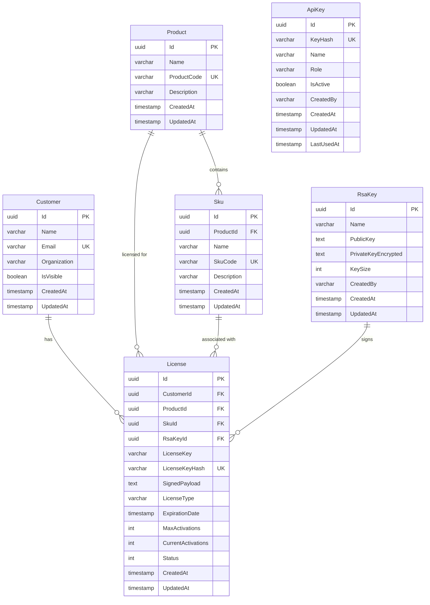

# Database Schema Documentation

## Overview

The License Management API uses PostgreSQL as its database system with Entity Framework Core as the ORM. The database schema is designed to support comprehensive license lifecycle management, customer tracking, product organization, and secure access control.

## Technology Stack

- **Database**: PostgreSQL
- **ORM**: Entity Framework Core with Npgsql provider
- **Migration Strategy**: Code-first with automatic migration application on startup
- **Timestamp Management**: Automatic via `SaveChanges` override

## Entity Relationship Diagram



## Tables

### Customer

Stores information about customers who purchase and hold licenses.

| Column | Type | Constraints | Description |
|--------|------|-------------|-------------|
| Id | UUID | PRIMARY KEY | Unique identifier for the customer |
| Name | VARCHAR | NOT NULL, INDEXED | Customer name (indexed for search performance) |
| Email | VARCHAR | NOT NULL, UNIQUE | Customer email address (unique constraint enforced) |
| Organization | VARCHAR | NULLABLE | Optional organization name |
| IsVisible | BOOLEAN | NOT NULL, DEFAULT TRUE | Visibility flag for customer profile |
| CreatedAt | TIMESTAMP | NOT NULL | Timestamp when customer was created (auto-managed) |
| UpdatedAt | TIMESTAMP | NOT NULL | Timestamp when customer was last updated (auto-managed) |

**Indexes:**
- `IX_Customers_Email` (Unique) - Enforces email uniqueness
- `IX_Customers_Name` - Performance optimization for name searches

**Relationships:**
- One-to-Many with License (Restrict delete - cannot delete customer with active licenses)

---

### Product

Stores software products for which licenses can be issued.

| Column | Type | Constraints | Description |
|--------|------|-------------|-------------|
| Id | UUID | PRIMARY KEY | Unique identifier for the product |
| Name | VARCHAR | NOT NULL, INDEXED | Product name (indexed for search performance) |
| ProductCode | VARCHAR | NOT NULL, UNIQUE | Unique product code identifier |
| Description | VARCHAR | NULLABLE | Optional product description |
| CreatedAt | TIMESTAMP | NOT NULL | Timestamp when product was created (auto-managed) |
| UpdatedAt | TIMESTAMP | NOT NULL | Timestamp when product was last updated (auto-managed) |

**Indexes:**
- `IX_Products_ProductCode` (Unique) - Enforces product code uniqueness
- `IX_Products_Name` - Performance optimization for name searches

**Relationships:**
- One-to-Many with Sku (Cascade delete - deleting product removes all SKUs)
- One-to-Many with License (Restrict delete - cannot delete product with active licenses)

---

### Sku

Stores Stock Keeping Units (SKUs) representing specific product variants or offerings.

| Column | Type | Constraints | Description |
|--------|------|-------------|-------------|
| Id | UUID | PRIMARY KEY | Unique identifier for the SKU |
| ProductId | UUID | FOREIGN KEY, NOT NULL, INDEXED | Reference to parent product |
| Name | VARCHAR | NOT NULL, INDEXED | SKU name (indexed for search performance) |
| SkuCode | VARCHAR | NOT NULL, UNIQUE | Unique SKU code identifier |
| Description | VARCHAR | NULLABLE | Optional SKU description |
| CreatedAt | TIMESTAMP | NOT NULL | Timestamp when SKU was created (auto-managed) |
| UpdatedAt | TIMESTAMP | NOT NULL | Timestamp when SKU was last updated (auto-managed) |

**Indexes:**
- `IX_Skus_SkuCode` (Unique) - Enforces SKU code uniqueness
- `IX_Skus_ProductId` - Performance optimization for filtering by product
- `IX_Skus_Name` - Performance optimization for name searches

**Relationships:**
- Many-to-One with Product (Cascade delete - SKU deleted when product is deleted)
- One-to-Many with License (Set null - SKU reference nullified when SKU is deleted)

---

### RsaKey

Stores RSA key pairs used for digitally signing licenses.

| Column | Type | Constraints | Description |
|--------|------|-------------|-------------|
| Id | UUID | PRIMARY KEY | Unique identifier for the RSA key pair |
| Name | VARCHAR | NOT NULL | Descriptive name for the key pair |
| PublicKey | TEXT | NOT NULL | RSA public key in PEM format |
| PrivateKeyEncrypted | TEXT | NOT NULL | Encrypted RSA private key |
| KeySize | INTEGER | NOT NULL | Key size in bits (e.g., 2048, 4096) |
| CreatedBy | VARCHAR | NOT NULL | Identifier of user who created the key |
| CreatedAt | TIMESTAMP | NOT NULL | Timestamp when key was created (auto-managed) |
| UpdatedAt | TIMESTAMP | NOT NULL | Timestamp when key was last updated (auto-managed) |

**Indexes:**
- None (primary key only)

**Relationships:**
- One-to-Many with License (Restrict delete - cannot delete key used by licenses)

**Security Notes:**
- Private keys are stored encrypted
- Public keys are stored in plain text for verification purposes
- Audit metadata tracks key creation and modifications

---

### License

Stores license information including keys, associations, and activation tracking.

| Column | Type | Constraints | Description |
|--------|------|-------------|-------------|
| Id | UUID | PRIMARY KEY | Unique identifier for the license |
| CustomerId | UUID | FOREIGN KEY, NOT NULL, INDEXED | Reference to customer who owns the license |
| ProductId | UUID | FOREIGN KEY, NOT NULL, INDEXED | Reference to licensed product |
| SkuId | UUID | FOREIGN KEY, NULLABLE | Optional reference to specific SKU |
| RsaKeyId | UUID | FOREIGN KEY, NOT NULL | Reference to RSA key used for signing |
| LicenseKey | VARCHAR | NOT NULL | Plain text license key (for initial distribution) |
| LicenseKeyHash | VARCHAR | NOT NULL, UNIQUE | Hashed license key for secure validation |
| SignedPayload | TEXT | NOT NULL | Digitally signed license payload |
| LicenseType | VARCHAR | NOT NULL | Type of license (e.g., "Trial", "Standard", "Enterprise") |
| ExpirationDate | TIMESTAMP | NULLABLE | Optional expiration date for the license |
| MaxActivations | INTEGER | NOT NULL | Maximum number of allowed activations |
| CurrentActivations | INTEGER | NOT NULL, DEFAULT 0 | Current number of activations |
| Status | INTEGER | NOT NULL, INDEXED | License status enum (Active=0, Expired=1, Revoked=2) |
| CreatedAt | TIMESTAMP | NOT NULL | Timestamp when license was created (auto-managed) |
| UpdatedAt | TIMESTAMP | NOT NULL | Timestamp when license was last updated (auto-managed) |

**Indexes:**
- `IX_Licenses_LicenseKeyHash` (Unique) - Enforces license key uniqueness and enables fast validation
- `IX_Licenses_CustomerId` - Performance optimization for filtering by customer
- `IX_Licenses_ProductId` - Performance optimization for filtering by product
- `IX_Licenses_Status` - Performance optimization for filtering by status

**Relationships:**
- Many-to-One with Customer (Restrict delete - cannot delete customer with licenses)
- Many-to-One with Product (Restrict delete - cannot delete product with licenses)
- Many-to-One with Sku (Set null - SKU reference nullified when SKU is deleted)
- Many-to-One with RsaKey (Restrict delete - cannot delete RSA key used by licenses)

**Security Notes:**
- License keys are hashed using secure one-way hashing with salt
- Validation uses constant-time comparison to prevent timing attacks
- Signed payload ensures license authenticity and integrity

---

### ApiKey

Stores API keys for authentication and authorization.

| Column | Type | Constraints | Description |
|--------|------|-------------|-------------|
| Id | UUID | PRIMARY KEY | Unique identifier for the API key |
| KeyHash | VARCHAR | NOT NULL, UNIQUE | Hashed API key for secure storage |
| Name | VARCHAR | NOT NULL | Descriptive name for the API key |
| Role | VARCHAR | NOT NULL | Role assigned to the API key (e.g., "Admin", "ReadOnly") |
| IsActive | BOOLEAN | NOT NULL, DEFAULT TRUE, INDEXED | Whether the API key is currently active |
| CreatedBy | VARCHAR | NOT NULL | Identifier of user who created the key |
| CreatedAt | TIMESTAMP | NOT NULL | Timestamp when key was created (auto-managed) |
| UpdatedAt | TIMESTAMP | NOT NULL | Timestamp when key was last updated (auto-managed) |
| LastUsedAt | TIMESTAMP | NULLABLE | Timestamp when key was last used for authentication |

**Indexes:**
- `IX_ApiKeys_KeyHash` (Unique) - Enforces key uniqueness and enables fast authentication
- `IX_ApiKeys_IsActive` - Performance optimization for filtering active keys

**Relationships:**
- None (standalone table)

**Security Notes:**
- API keys are hashed using secure one-way hashing
- Authentication results are cached for 5 minutes to optimize performance
- Cache is invalidated when API key is deleted or modified

---

## Cascade Delete Behavior

The database implements specific cascade delete rules to maintain referential integrity:

| Parent Table | Child Table | Delete Behavior | Rationale |
|--------------|-------------|-----------------|-----------|
| Product | Sku | CASCADE | SKUs are meaningless without their parent product |
| Product | License | RESTRICT | Prevents accidental deletion of products with active licenses |
| Customer | License | RESTRICT | Prevents accidental deletion of customers with active licenses |
| Sku | License | SET NULL | Licenses remain valid even if SKU is deleted |
| RsaKey | License | RESTRICT | Prevents deletion of keys used to sign existing licenses |

## Unique Constraints

The following unique constraints are enforced at the database level:

- **Customer.Email** - Ensures each email address is used only once
- **Product.ProductCode** - Ensures each product code is unique
- **Sku.SkuCode** - Ensures each SKU code is unique
- **License.LicenseKeyHash** - Ensures each license key is unique
- **ApiKey.KeyHash** - Ensures each API key is unique

## Performance Indexes

Performance indexes are strategically placed on frequently queried fields:

### Search Optimization
- Customer.Name - Enables fast customer name searches
- Product.Name - Enables fast product name searches
- Sku.Name - Enables fast SKU name searches

### Foreign Key Optimization
- Sku.ProductId - Optimizes queries filtering SKUs by product
- License.CustomerId - Optimizes queries filtering licenses by customer
- License.ProductId - Optimizes queries filtering licenses by product

### Status Filtering
- License.Status - Optimizes queries filtering licenses by status (active, expired, revoked)
- ApiKey.IsActive - Optimizes queries filtering active API keys

### Security and Validation
- License.LicenseKeyHash - Enables fast license key validation
- ApiKey.KeyHash - Enables fast API key authentication

## Automatic Timestamp Management

All entities include `CreatedAt` and `UpdatedAt` timestamps that are automatically managed by the `LicenseManagementDbContext`:

- **CreatedAt**: Set automatically when an entity is first added to the database
- **UpdatedAt**: Updated automatically whenever an entity is modified

This is implemented via the `SaveChanges` and `SaveChangesAsync` overrides in the DbContext, ensuring consistent timestamp tracking across all entities without manual intervention.

## Migration Strategy

The database uses Entity Framework Core migrations with the following approach:

1. **Code-First**: Database schema is defined through C# entity classes
2. **Version Control**: Migrations are stored in the `Migrations` folder and tracked in source control
3. **Automatic Application**: Pending migrations are automatically applied on application startup
4. **Rollback Support**: Migrations can be rolled back using EF Core CLI tools

### Creating a New Migration

```bash
dotnet ef migrations add MigrationName --project LicenseManagementApi
```

### Applying Migrations Manually

```bash
dotnet ef database update --project LicenseManagementApi
```

### Rolling Back a Migration

```bash
dotnet ef database update PreviousMigrationName --project LicenseManagementApi
```

## Connection Configuration

Database connection is configured in `appsettings.json`:

```json
{
  "ConnectionStrings": {
    "DefaultConnection": "Host=localhost;Database=license_management;Username=postgres;Password=your_password"
  }
}
```

### Connection Pooling

The application uses Npgsql's built-in connection pooling for optimal performance:
- Connections are reused across requests
- Pool size is managed automatically by Npgsql
- Reduces connection overhead and improves scalability

## Data Types and Conventions

### Primary Keys
- All tables use UUID (Guid in C#) as primary keys
- UUIDs provide globally unique identifiers suitable for distributed systems

### String Fields
- Required string fields use `VARCHAR` with appropriate lengths
- Large text fields (keys, payloads) use `TEXT` type
- Empty strings are preferred over NULL for required fields

### Timestamps
- All timestamps are stored in UTC
- Nullable timestamps (e.g., ExpirationDate, LastUsedAt) indicate optional values

### Boolean Fields
- Use PostgreSQL `BOOLEAN` type
- Default values are specified where appropriate (e.g., IsVisible, IsActive)

### Enumerations
- Stored as integers in the database
- Mapped to C# enums in the application layer
- Example: LicenseStatus (Active=0, Expired=1, Revoked=2)

## Security Considerations

### Sensitive Data Storage
- **License Keys**: Stored as hashed values using secure one-way hashing with salt
- **API Keys**: Stored as hashed values using secure one-way hashing
- **RSA Private Keys**: Stored encrypted, never in plain text
- **RSA Public Keys**: Stored in plain text (required for verification)

### Audit Trail
- CreatedBy and audit metadata track who created sensitive resources (RSA keys, API keys)
- Timestamps provide temporal audit trail for all entities
- LastUsedAt tracks API key usage patterns

### Access Control
- Database-level constraints enforce data integrity
- Application-level authorization controls who can perform operations
- Restrict delete behaviors prevent accidental data loss

## Scalability Considerations

### Horizontal Scaling
- Stateless design allows multiple application instances
- Connection pooling optimizes database connection usage
- Indexes optimize query performance under load

### Pagination
- All list endpoints support pagination with maximum page size of 100
- Prevents excessive memory usage and improves response times

### Caching
- API key validation results cached for 5 minutes
- Reduces database load for authentication operations
- Cache invalidation on key deletion ensures security

## Maintenance and Monitoring

### Health Checks
- Health check endpoint verifies PostgreSQL connectivity
- Returns unhealthy status if database is unreachable
- Target response time: 200 milliseconds

### Logging
- Serilog provides structured logging for all database operations
- Exception details and stack traces logged for troubleshooting
- Connection errors and query failures captured

### Backup Recommendations
- Regular automated backups of PostgreSQL database
- Point-in-time recovery capability
- Test restore procedures regularly

## Requirements Traceability

This database schema satisfies the following requirements:

- **Requirement 11.1**: Entity Framework Core with Npgsql for all database operations
- **Requirement 11.2**: Automatic timestamp management for all entities
- **Requirement 11.3**: Database indexes on frequently queried fields
- **Requirement 11.4**: Cascade delete rules configured to maintain relational integrity
- **Requirement 11.5**: Database migrations for version-controlled schema evolution
- **Requirement 11.6**: Automatic migration application on startup
