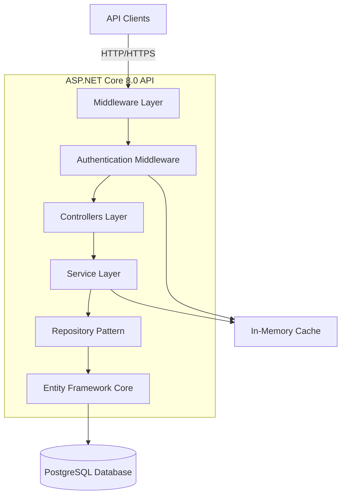
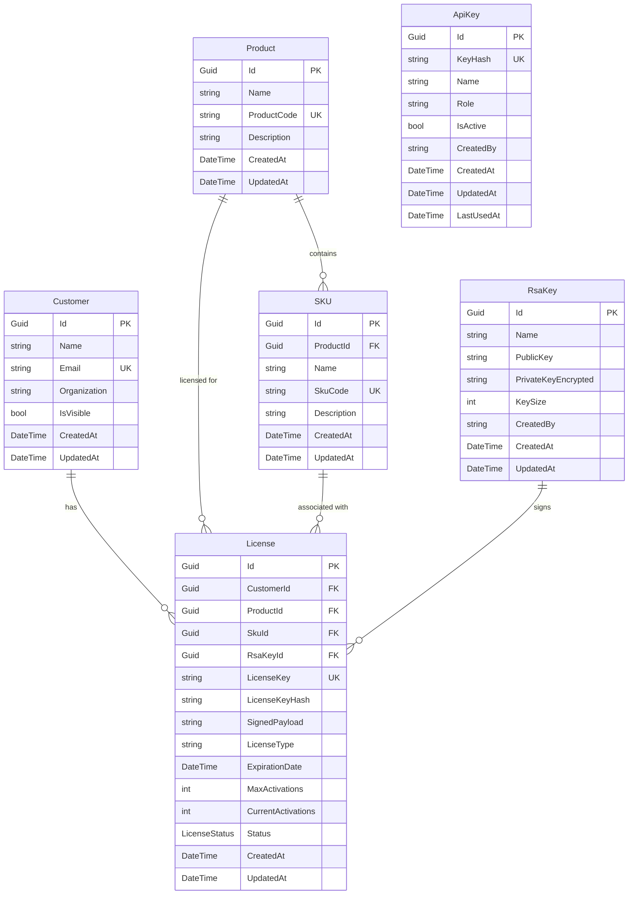

# License Management API - Design Document

## Overview

The License Management API is a secure, scalable backend system built on ASP.NET Core 8.0 with PostgreSQL. It provides comprehensive license lifecycle management, customer relationship tracking, and secure key generation and validation capabilities for software vendors.

### Key Design Principles

- **Layered Architecture**: Clear separation between Controllers, Services, and Data Access layers
- **Interface-Based Design**: Controllers depend on service interfaces, not implementations, enabling testability and flexibility
- **Unified Response Pattern**: All service methods return `ServiceResult<T>` objects for consistent error handling
- **Security First**: API key authentication with role-based access control and cryptographic key management
- **Data Integrity**: Entity Framework Core with cascade deletes and database constraints
- **Structured Logging**: Serilog for comprehensive observability

## Architecture

### High-Level Architecture



### Layer Responsibilities

#### 1. Controllers Layer
- Handle HTTP requests and responses
- Validate request models using data annotations
- Map `ServiceResult<T>` to appropriate HTTP status codes
- No business logic - delegate to services

#### 2. Service Layer
- Encapsulate all business logic
- Return `ServiceResult<T>` for all operations
- Handle exceptions and convert to structured errors
- Coordinate between multiple repositories when needed
- Implement caching strategies

#### 3. Repository Layer
- Abstract data access using Entity Framework Core
- Provide CRUD operations for entities
- Handle database-specific operations
- Implement query optimization

#### 4. Data Layer
- Entity Framework Core with Npgsql provider
- Database migrations for schema evolution
- Automatic timestamp management
- Cascade delete configurations

## Components and Interfaces

### Core Service Interfaces

```csharp
// Customer Management
public interface ICustomerService
{
    Task<ServiceResult<CustomerDto>> CreateCustomerAsync(CreateCustomerRequest request);
    Task<ServiceResult<CustomerDto>> GetCustomerByIdAsync(Guid id);
    Task<ServiceResult<CustomerDto>> GetCustomerByNameAsync(string name);
    Task<ServiceResult<IEnumerable<CustomerDto>>> SearchCustomersAsync(string searchTerm, int page, int pageSize);
    Task<ServiceResult<CustomerDto>> UpdateCustomerAsync(Guid id, UpdateCustomerRequest request);
    Task<ServiceResult<bool>> DeleteCustomerAsync(Guid id);
    Task<ServiceResult<bool>> DeleteCustomerByNameAsync(string name);
    Task<ServiceResult<PagedResult<CustomerDto>>> ListCustomersAsync(int page, int pageSize);
}

// Product Management
public interface IProductService
{
    Task<ServiceResult<ProductDto>> CreateProductAsync(CreateProductRequest request);
    Task<ServiceResult<ProductDto>> GetProductByIdAsync(Guid id);
    Task<ServiceResult<ProductDto>> UpdateProductAsync(Guid id, UpdateProductRequest request);
    Task<ServiceResult<bool>> DeleteProductAsync(Guid id);
    Task<ServiceResult<PagedResult<ProductDto>>> ListProductsAsync(int page, int pageSize);
    Task<ServiceResult<IEnumerable<ProductDto>>> SearchProductsAsync(string searchTerm, int page, int pageSize);
}

// SKU Management
public interface ISkuService
{
    Task<ServiceResult<SkuDto>> CreateSkuAsync(CreateSkuRequest request);
    Task<ServiceResult<SkuDto>> GetSkuByIdAsync(Guid id);
    Task<ServiceResult<SkuDto>> UpdateSkuAsync(Guid id, UpdateSkuRequest request);
    Task<ServiceResult<bool>> DeleteSkuAsync(Guid id);
    Task<ServiceResult<PagedResult<SkuDto>>> ListSkusAsync(int page, int pageSize);
    Task<ServiceResult<PagedResult<SkuDto>>> ListSkusByProductAsync(Guid productId, int page, int pageSize);
    Task<ServiceResult<IEnumerable<SkuDto>>> SearchSkusAsync(string searchTerm, int page, int pageSize);
}

// RSA Key Management
public interface IRsaKeyService
{
    Task<ServiceResult<RsaKeyDto>> GenerateKeyPairAsync(GenerateRsaKeyRequest request);
    Task<ServiceResult<RsaKeyDto>> GetKeyByIdAsync(Guid id);
    Task<ServiceResult<string>> DownloadPrivateKeyAsync(Guid id);
    Task<ServiceResult<RsaKeyDto>> UpdateKeyAsync(Guid id, UpdateRsaKeyRequest request);
    Task<ServiceResult<bool>> DeleteKeyAsync(Guid id);
    Task<ServiceResult<PagedResult<RsaKeyDto>>> ListKeysAsync(int page, int pageSize);
}

// License Management
public interface ILicenseService
{
    Task<ServiceResult<LicenseDto>> CreateLicenseAsync(CreateLicenseRequest request);
    Task<ServiceResult<LicenseDto>> GetLicenseByIdAsync(Guid id);
    Task<ServiceResult<LicenseDto>> UpdateLicenseAsync(Guid id, UpdateLicenseRequest request);
    Task<ServiceResult<bool>> DeleteLicenseAsync(Guid id);
    Task<ServiceResult<bool>> RevokeLicenseAsync(Guid id);
    Task<ServiceResult<PagedResult<LicenseDto>>> ListLicensesAsync(int page, int pageSize);
    Task<ServiceResult<PagedResult<LicenseDto>>> ListLicensesByCustomerAsync(Guid customerId, int page, int pageSize);
    Task<ServiceResult<PagedResult<LicenseDto>>> ListLicensesByProductAsync(Guid productId, int page, int pageSize);
    Task<ServiceResult<PagedResult<LicenseDto>>> ListLicensesByStatusAsync(LicenseStatus status, int page, int pageSize);
    Task<ServiceResult<LicenseValidationResult>> ValidateLicenseKeyAsync(string licenseKey);
    Task<ServiceResult<LicenseActivationResult>> ActivateLicenseKeyAsync(string licenseKey);
}

// API Key Management
public interface IApiKeyService
{
    Task<ServiceResult<ApiKeyDto>> CreateApiKeyAsync(CreateApiKeyRequest request);
    Task<ServiceResult<ApiKeyDto>> GetApiKeyByIdAsync(Guid id);
    Task<ServiceResult<ApiKeyDto>> UpdateApiKeyAsync(Guid id, UpdateApiKeyRequest request);
    Task<ServiceResult<bool>> DeleteApiKeyAsync(Guid id);
    Task<ServiceResult<PagedResult<ApiKeyDto>>> ListApiKeysAsync(int page, int pageSize);
    Task<ServiceResult<ApiKeyValidationResult>> ValidateApiKeyAsync(string apiKey);
}

// Authentication Service
public interface IAuthenticationService
{
    Task<ServiceResult<AuthenticationResult>> AuthenticateAsync(string apiKey);
    Task InvalidateCacheAsync(string apiKey);
}
```

### ServiceResult Pattern

```csharp
public class ServiceResult<T>
{
    public bool IsSuccess { get; set; }
    public T Data { get; set; }
    public string ErrorMessage { get; set; }
    public string ErrorCode { get; set; }
    public Dictionary<string, string[]> ValidationErrors { get; set; }
    
    public static ServiceResult<T> Success(T data) => new() { IsSuccess = true, Data = data };
    public static ServiceResult<T> Failure(string errorMessage, string errorCode = null) 
        => new() { IsSuccess = false, ErrorMessage = errorMessage, ErrorCode = errorCode };
    public static ServiceResult<T> ValidationFailure(Dictionary<string, string[]> errors)
        => new() { IsSuccess = false, ValidationErrors = errors };
}
```

## Data Models

### Entity Relationships



### Entity Definitions

